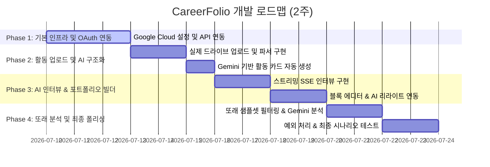

# 🚀 CareerFolio 개발 계획서 (Phased Development Plan)

본 문서는 **CareerFolio (AI 기반 커리어 포트폴리오 통합 플랫폼)** PRD v5.0을 기반으로 수립된 페이즈 단위의 구체적인 개발 계획서입니다. 
본 프로젝트는 **실제 연동 영역(Google Gemini API, Google Drive Storage)**과 **목업 영역(로그인, DB 영속화, 또래 데이터)**이 분리되어 있으므로, 실구현 요소를 조기에 완성하고 연동하는 데 초점을 맞춥니다.

---

## 📅 전체 일정 및 핵심 목표 (총 2주)

- **목표:** AI 엔진과 구글 드라이브 스토리지를 실제로 연동하여, 끊김 없는 4가지 핵심 기능 사용자 시나리오(Happy Path)를 시연할 수 있는 데모를 완성합니다.
- **전체 기간:** 14일 (2주)

---

## 🔍 페이즈별 상세 개발 계획

### 📍 Phase 1: 기본 인프라 구축 및 Google OAuth 연동 (Day 1 ~ Day 3)
**목표:** Google Cloud Console 연동을 완료하고, 파일 스토리지를 사용할 수 있도록 OAuth 토큰 및 세션을 확보합니다.

- **주요 작업 내용:**
  - **Google Cloud 설정:** Console 프로젝트 생성, Google Drive API 활성화, OAuth 동의 화면 구성(테스트 사용자 등록).
  - **Gemini API 연동 준비:** `GEMINI_API_KEY` 발급 및 로컬 `.env.local` 연동.
  - **Google OAuth 구현:** `drive.file` 스코프 권한 획득을 위한 OAuth 콜백 라우트(`/api/google/oauth/callback`) 실제 연동.
  - **공통 상태 정의:** Zustand를 사용해 사용자 세션 정보 및 로컬 활동(Activity) 상태 관리를 위한 스토어 구조 설계.
- **산출물:** 
  - [x] API 키 및 OAuth 로컬 환경 변수 설정
  - [x] [google-drive.ts](file:///Users/yoonsiwoong/AI/src/lib/google-drive.ts) 기본 연동 클라이언트
  - [x] 실제 Google 계정 연동 및 동의 화면 진입 테스트 완료

---

### 📍 Phase 2: 활동 업로드 및 Gemini 카드 구조화 (Day 4 ~ Day 5)
**목표:** 로컬 파일을 Google Drive에 업로드하고, 서버에서 임시 텍스트를 추출한 후 Gemini를 통해 활동 카드 형태로 구조화합니다.

- **주요 작업 내용:**
  - **Google Drive 업로드:** 클라이언트에서 전용 폴더(`CareerFolio`)를 생성하고 파일을 실제로 업로드하는 로직 구현.
  - **텍스트 파서 연동:** `pdf-parse`, `mammoth`, `sheetjs`, `jszip` 라이브러리를 사용해 서버로 전달된 문서의 텍스트를 메모리상에서 추출 및 예외 처리.
  - **활동 카드 구조화:** Gemini API의 `responseSchema`를 활용하여 추출된 텍스트를 JSON 형태(제목, 요약, 기간, 역할, 키워드)로 매핑.
  - **화면 구현:** 대시보드 화면에 파일 드롭 존 및 AI 처리 상태(로딩 스켈레톤, `NEEDS_MANUAL_INPUT` 폴백) 연동.
- **산출물:**
  - [ ] 파일 업로드 및 서버 임시 파서 파이프라인
  - [ ] [/api/activities](file:///Users/yoonsiwoong/AI/src/app/api/activities/route.ts) API 라우트 실제 동작
  - [ ] 대시보드 활동 카드 자동 생성 기능 및 수동 입력 UI

---

### 📍 Phase 3: AI 기반 인터뷰 & 포트폴리오 에디터 (Day 6 ~ Day 9)
**목표:** STAR 프레임워크에 따른 스트리밍 인터뷰를 진행하고, 축적된 데이터를 활용해 직무 맞춤형 포트폴리오 초안 에디터를 완성합니다.

- **주요 작업 내용:**
  - **인터뷰 스트리밍 구현:** Gemini API의 `generateContentStream`을 연동해 실시간 질문 및 피드백을 SSE(Server-Sent Events) 형태로 노출.
  - **대화 및 로직 제어:** 답변 구체성 평가 루브릭을 프롬프트에 심고, 피로 방지를 위한 재질문 횟수 제한(최대 2회) 로직 적용.
  - **포트폴리오 생성:** 선택한 직무 가이드에 따라 컨텍스트(활동 카드+Q&A)를 조합하여 초안 생성 API(`/api/portfolio/generate`) 구축.
  - **에디터 셋업:** Tiptap 에디터를 활용해 생성된 블록 수정 및 드래그 순서 변경 기능과 Gemini를 활용한 AI 부분 재작성(리라이트) 기능 연동.
- **산출물:**
  - [ ] [/api/interview/stream](file:///Users/yoonsiwoong/AI/src/app/api/interview/stream/route.ts) 스트리밍 SSE 엔드포인트
  - [ ] 인터뷰 진행 대화형 UI (스트리밍 완료)
  - [ ] Tiptap 기반 포트폴리오 블록 에디터 및 AI 리라이트 기능

---

### 📍 Phase 4: 또래 비교 분석 및 최종 폴리싱 (Day 10 ~ Day 14)
**목표:** 익명화된 또래 데이터셋과 내 포트폴리오를 비교 분석하고, 예외 처리와 품질 튜닝을 통해 최종 데모를 검증합니다.

- **주요 작업 내용:**
  - **또래 분석 구현:** 로컬 목업 데이터셋([peer-dataset.ts](file:///Users/yoonsiwoong/AI/src/mock/peer-dataset.ts))에서 필터링한 데이터와 사용자 데이터를 비교하는 Gemini 프롬프트 구현.
  - **시각화:** 비교 결과 점수를 바탕으로 레이더 차트(Recharts)를 렌더링하고 맞춤 개선 제안 리스트 출력.
  - **예외 처리:** API 타임아웃, Gemini 스키마 불일치, 구글 토큰 만료 시 재동의 배너 유도 등 비정상 상황 흐름 처리.
  - **성능 및 보안 검증:** AI 호출당 대기 시간 최소화(로딩 처리) 및 API 노출 확인.
- **산출물:**
  - [ ] [/api/analysis](file:///Users/yoonsiwoong/AI/src/app/api/analysis/route.ts) API 라우트
  - [ ] 갭 분석 페이지(레이더 차트 및 피드백)
  - [ ] 최종 시나리오 테스트(Happy Path) 시연 녹화 및 검증

---

## 🛠 리스크 요인 및 대응 방안

| 리스크 요인 | 영향도 | 대응 방안 |
|:---|:---:|:---|
| **Gemini API 응답 지연 (P90 > 30초)** | **상** | - 비스트리밍 구간(초안 생성)에 풍부한 애니메이션 스켈레톤 제공 - 인터뷰는 무조건 스트리밍(SSE)으로 첫 반응 속도(TTFB)를 2초 이내 확보 |
| **API 사용 요금 발생** | **중** | - 파일 크기 사전 차단(최대 20MB) - 단일 IP/세션당 하루 파일 등록 횟수 제한(Rate Limit) 고려 |
| **구글 OAuth 앱 미검수 경고** | **하** | - 시연 시나리오 상에서 테스트 사용자 계정을 미리 등록하여 사용하므로 문제 없음 |
| **Prisma/DB 및 실 로그인 부재** | **중** | - Zustand 스토어를 이용한 클라이언트 세션 상태 유지를 철저히 모니터링하여, 사용자가 새로고침하기 전까지 상태가 유실되지 않도록 설계 |
